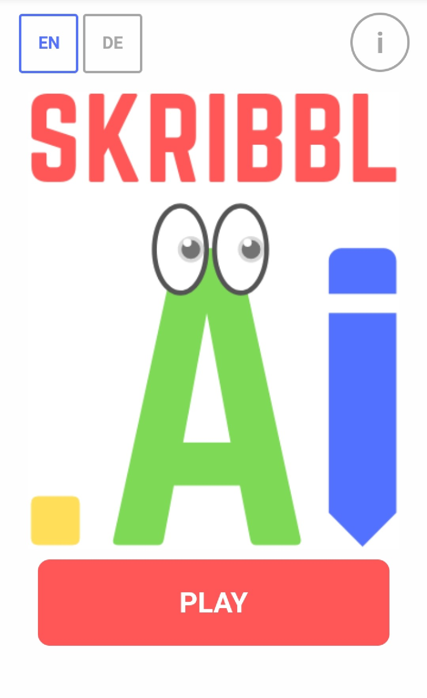

# SkribblAI
HTW IMI Praxisprojekt

This is a browser game where you can draw stuff and if the AI recognizes what you drew you win.
The Website is build with HTML, CSS and JS, the AI was written and trained with Python and integrated with TensorFlow/Keras

For more information check:

https://www.canva.com/design/DADQBb6yIes/y7Gjn2x9IVFzlQqtcMCfbQ/view?utm_content=DADQBb6yIes&utm_campaign=designshare&utm_medium=link&utm_source=sharebutton

and

https://www.canva.com/design/DADPsEoHYy8/VMQxX6Eyc7k8kMnJFVmi3g/view?utm_content=DADPsEoHYy8&utm_campaign=designshare&utm_medium=link&utm_source=sharebutton

## sass

Requirements:
- Node.js & npm (https://nodejs.org/en/)
- sass ```npm install -g sass```
- grunt ```npm install -g grunt-cli```

Steps:
- In terminal navigate to scss folder
- run ```npm install```
- run ```grunt```
